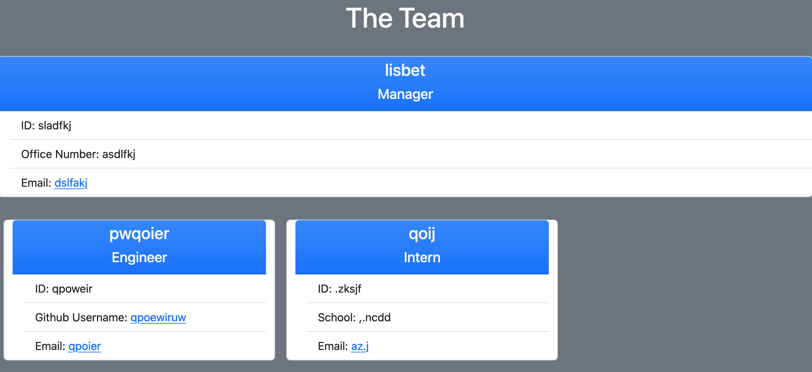

# Employee Prompter

## Description
This app introduces OOP and the notion of classes and subclasses for the first time. Building it allowed me to get practice with linking everything we've done so far in class.

## Table of Contents
- [Installation](#installation)
- [Usage](#usage)
- [Credits](#credits)
- [Contributing](#contributing)
- [Tests](#tests)
- [License](#license)

## Installation
run npm i employeeprompter

## Usage
When you type in node index.js on the command line, a prompt should come up to enter info for a team manager. After that ,the user can choose to add aditional interns and engineers or to stop there. an html file representing the team on a webpage can then be found at ./output/index.html

## Credits
  This project could not have been completed without Inquirer and Jest.
  
## Contributing
If you want to add to this project, please contact me with the information in the questions section.

## Tests
Run npm test to see the tests for this project.

## Questions
If you have questions or otherwise want to contact me, you can send me an email at  or find me on Github as [emilyerose](https://github.com/emilyerose) 

